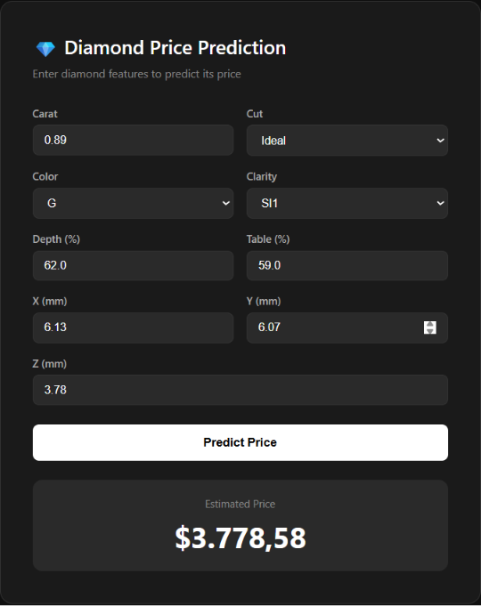

# 💎 Diamond Price Prediction


An end-to-end machine learning project that predicts diamond prices using Support Vector Regression (SVR).

## 🌐 Live Demo
[https://diamond-prediction-app-gohq.onrender.com](https://diamond-prediction-app-gohq.onrender.com)

## 📸 Screenshot




## 📋 Project Structure

```
diamond-prediction-app/
├── app/
│   ├── __init__.py
│   ├── main.py           # FastAPI application
│   ├── predictor.py      # Model loading and prediction
│   ├── schemas.py        # Pydantic models
│   └── templates/
│       └── index.html    # Web interface
├── artifacts/
│   └── diamond_model.pkl
├── assets/
│   └── app_screenshot.png
├── data/
│   └── diamonds_cleaned.csv
├── notebooks/
│   ├── 01_eda_and_preprocessing.ipynb
│   └── 02_model_training_and_mlflow.ipynb
├── tests/
│   ├── __init__.py
│   └── test_api.py
├── .github/
│   └── workflows/
│       └── deploy.yml
├── Dockerfile
├── requirements.txt
└── README.md
```

## 📊 Dataset
[Diamonds Dataset - Kaggle](https://www.kaggle.com/datasets/shivam2503/diamonds)

- 53,940 diamonds (53,905 after cleaning)
- Features: carat, cut, color, clarity, depth, table, x, y, z
- Target: price (USD)

## 🛠️ Tech Stack

| Category | Tools |
|---|---|
| ML | Scikit-learn, SVR, GridSearchCV |
| Experiment Tracking | MLflow |
| API | FastAPI, Uvicorn |
| Logging | Loguru |
| Testing | Pytest |
| Containerization | Docker |
| CI/CD | GitHub Actions |
| Deployment | Render |

## 📈 Model Performance

| Metric | Value |
|---|---|
| R² Train | 0.9667 |
| R² Test | 0.9651 |
| MAE | $352 |
| RMSE | $739 |

## 🔍 Feature Importance

| Feature | Importance |
|---|---|
| carat | 0.439 |
| cut | 0.238 |
| color | 0.229 |
| clarity | 0.219 |
| x | 0.119 |
| table | 0.079 |
| y | 0.005 |
| depth | 0.005 |
| z | 0.004 |

## ⚙️ Installation

### 1. Clone the repository
```bash
git clone https://github.com/mehmettanriverdii/diamond-prediction-app.git
cd diamond-prediction-app
```

### 2. Create virtual environment
```bash
python -m venv venv

# Windows
venv\Scripts\activate

# Mac/Linux
source venv/bin/activate
```

### 3. Install dependencies
```bash
pip install -r requirements.txt
```

### 4. Download dataset
Download `diamonds.csv` from [Kaggle](https://www.kaggle.com/datasets/shivam2503/diamonds) and place it in the `data/` folder.

### 5. Run notebooks
Run the notebooks in order:
1. `01_eda_and_preprocessing.ipynb`
2. `02_model_training_and_mlflow.ipynb`

### 6. Run the application
```bash
uvicorn app.main:app --reload --port 8000
```

Open [http://localhost:8000](http://localhost:8000)

## 🐳 Docker

```bash
# Build
docker build -t diamond-prediction-app .

# Run
docker run -p 8000:8000 diamond-prediction-app
```

## 🧪 Tests

```bash
pip install pytest httpx
pytest tests/ -v
```

3 tests:
- `test_health` → health endpoint check
- `test_predict` → prediction endpoint check
- `test_invalid_input` → input validation check

## 📡 API Endpoints

| Endpoint | Method | Description |
|---|---|---|
| `/` | GET | Web interface |
| `/predict` | POST | Predict diamond price |
| `/health` | GET | Health check |
| `/docs` | GET | Swagger UI |

### Predict Example

```bash
curl -X POST "http://localhost:8000/predict" \
     -H "Content-Type: application/json" \
     -d '{
       "carat": 0.89,
       "cut": "Premium",
       "color": "H",
       "clarity": "SI1",
       "depth": 62.0,
       "table": 59.0,
       "x": 6.13,
       "y": 6.07,
       "z": 3.78
     }'
```

### Response

```json
{
  "predicted_price": 3778.58,
  "currency": "USD"
}
```

## 🔬 MLflow

```bash
mlflow ui --backend-store-uri sqlite:///mlflow.db --port 5000
```

Open [http://localhost:5000](http://localhost:5000)

## 📄 License
This project is for educational purposes and is free to use.

## 👤 Author
Mehmet TANRIVERDİ - [GitHub](https://github.com/mehmettanriverdii)

> **Developer Note:** This project demonstrates how to deploy an end-to-end machine learning pipeline (SVR) to production. For real-world applications, additional security, monitoring, and scaling features should be implemented.